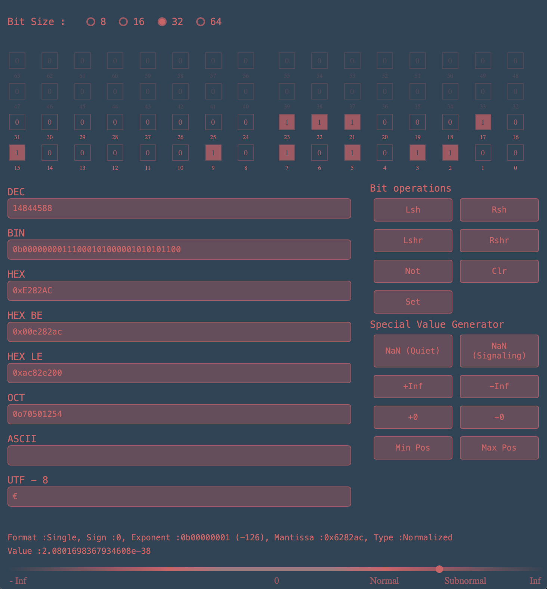

# BitViz - Interactive Bit Manipulation Tool


A cross-platform desktop application for visualizing and manipulating 64-bit values, built with Rust + Tauri + Leptos.



## Features

- **64-bit Visualization Grid**
    - Interactive clickable bits
    - Bit numbering and hover tooltips
    - Active state highlighting
- **Real-time Base Conversion**
    - Decimal (DEC)
    - Binary (BIN) with `0b` prefix
    - Hexadecimal (HEX) with `0x` prefix
    - Octal (OCT) with `0o` prefix
- **Bitwise Operations**
    - Logical shifts (Lsh/Rsh)
    - Cyclic shifts (Lshr/Rshr)
    - NOT, Clear, and Set All operations
- **Input Validation**
    - Auto-formatting for different bases
    - Instant synchronization between fields
    - Error recovery for invalid inputs
- **Responsive Design**
    - Adaptive grid layout
    - Mobile-friendly interface
    - Sticky operation panel

## Tech Stack

### Core Technologies
- **Rust** - Systems programming language
- **Tauri** - Desktop application framework
- **Leptos** - Reactive UI framework

### Why This Stack?
- **Performance** - Rust's zero-cost abstractions
- **Safety** - Memory safety guarantees
- **Size** - Minimal final binary (~2MB)
- **Cross-platform** - Windows/Linux/macOS support

## Installation

### Prerequisites
1. Install [Rust](https://www.rust-lang.org/tools/install)
2. Install [Tauri prerequisites](https://tauri.app/v1/guides/getting-started/prerequisites)

### Build & Run
```bash
cargo install tauri-cli
cargo tauri dev
```

## Tested with:

- Rust 1.72+
- Node.js 18+
- Tauri 1.4+
- Usage

## Bit Grid

Click individual bits to toggle values
Hover over bits to see position information
Visual grouping every 8 bits
Input Fields

- **DEC** - Enter decimal numbers (0-18446744073709551615)
- **BIN** - Format: 0b[01]{1,64}
- **HEX** - Format: 0x[0-9A-F]{1,16}
- **OCT** - Format: 0o[0-7]{1,22}

## Operations

- Lsh: (Logical Shift Left):	Shift bits left by 1 position
- Rsh: (Logical Shift Right):	Shift bits right by 1 position
- Lshr:	(Cyclic Shift Left):	Rotate bits left with carry
- Rshr:	(Cyclic Shift Right):	Rotate bits right with carry
- Not:	(Bitwise NOT):	Invert all bits
- Clr:	(Clear):	Set all bits to 0
- Set:	(Set All):	Set all bits to 1

## License

Apache 2.0 © 2024 [xvi.xv.xii.ix.xxii.ix.xiv]
